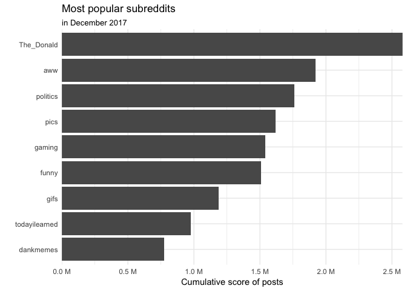
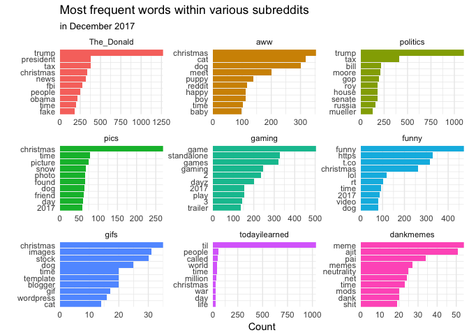
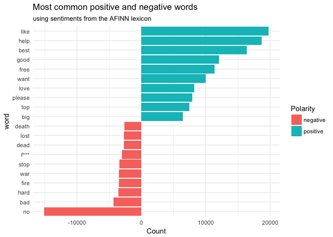
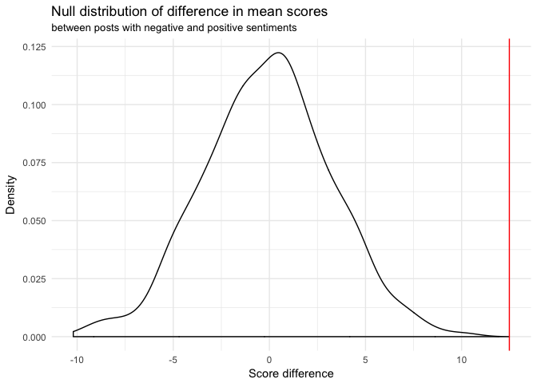
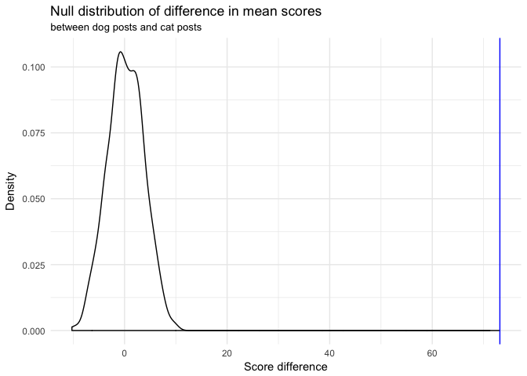
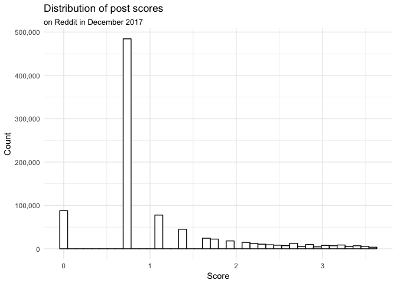

What makes a popular Reddit post?
================
InterstellR
May 2, 2018

Introduction
------------

The website Reddit, also known as "the front page of the internet," is a social news platform that derives its content from posts made by users from all over the world. The post can range from cute cat photos to serious news about our political system. Reddit's users represent individuals from different backgrounds, opinions, and places. People can upload their pictures, thoughts, and opinions, and other users give them feedback in the form of comments and votes. Posts with the most likes appear more towards the top of the website and therefore get more attention. Reddit is divided into thematic categories called subreddits and also allows for sorting by top posts, new posts, controversial posts, and criteria.

#### Research Question

Coincidentally, our team is made up of avid Reddit fans. All three of us are constantly checking it for interesting, insightful, and funny posts. Given that Reddit receives thousands of posts per day and the little time in the day we have to check Reddit, we all usually only check the "popular" feed. So, we thought that we should learn more about the site we know and love. Specifically, we want to analyze what exactly makes a Reddit post popular.

#### Data Set

We found a dataset of Reddit posts from December 2017 published on Google BigQuery. In the full dataset, there were over 10 million entries, but we decided to focus on a random sample of 1 million due to constrained computation and memory resources. Each row in the dataset represents a post made by a user. The data set contains 33 variables, all of which are explained in the accompanying data dictionary. Some of the ones we are most interested in are `num_comments`, which is the number of comments for the post, `stickied`, which indicates whether the post has been chosen to appear at the very top of a subreddit, `over_18`, which indicates whether users need to be 18 in order to view it, `gilded`, which denotes the number of [Reddit Gold](https://www.reddit.com/gold/about/) donations the poster received for the post, as well as `title`, `subreddit`, and `score`. The post's score will be a primary focus of our analysis and represents the difference between the total number of upvotes and downvotes the post received. The higher the score, the more popular the post.

Exploring Term Frequencies
--------------------------

We all spend most of our time browsing the front page of Reddit and do not know much about the various subreddits yet. Hence, we want to start by finding out what the most popular ones are and gain insights into what the posts in each one are about. As a measure of a subreddit's popularity, we decide to use the cumulative score of all of its posts. The plot below shows the nine subreddits with the highest resulting totals.

We find that the nine most popular subreddits in descending order are `The_Donald`, `aww`, `politics`, `pics`, `gaming`, `funny`, `gifs`, `todayilearned`, and `dankmemes`. We may be able to intuit what most of these subreddits are about from their name alone, but we wanted to know more about the content and central topics in each of them. Therefore, we decided to analyze the most frequent terms in each of these subreddits with the help of the `tidytext` package. We want to focus on the text contained in the title of the posts since it is the first thing that is visible to the users. Furthermore, we decided to filter out stop words such as "the" and "a" because they naturally appear very frequently and do not convey much about the content of any one particular subreddit.

The results are interesting because it seems like the top subreddits are very diverse. As we expected, posts in `The_Donald` mostly talk about Donald Trump, Obama, and fake news, and posts in `gaming` unsurprisingly talk about games, trailers, and apparently the game DayZ. Posters in `funny` appear to like sharing links, seeing as the words "https" and "t.co" are very frequent, and `dankmemes` is all about Ajit Pai, who is the chairman of the FCC, as well as net neutrality. The `aww` subreddit frequently mentions cats, dogs, and babies, and overall, people seem to mention Christmas frequently, which makes sense given that these posts are from December.

Sentiment Analysis
------------------

One of the major questions we want to explore is whether positive or negative posts are more popular. Our hypothesis is that negative posts are generally more popular, as psychologists claim that humans have an innate "negativity bias" which draws them toward bad news moreso than good ones (Ito et al. 1998). To test this belief, we need a way to determine the sentiment polarity of each post, i.e. how positive or negative it is. We will use the `afinn` sentiment lexicon, which provides a list of 2476 words, each associated with a score between -3 and +3. Negative words are given a negative score, and positive words are given a positive score. The higher in magnitude the score is, the more extreme the negativity or positivity of the word. For example, the word "death" has a score of -3 whereas the word "love" has a score of +3. In order to determine the overall sentiment of a post, we will simply add up the sentiments of the words contained in it.

We find that the average sentiment score of the posts is 0.15 with a large standard deviation of 1.94. Interestingly, the title with the most positive sentiment is "Ha ha ha ha ha ha ha ha h ha ha ha ha ha ha ha ha ha ha ha ha ha ha ha ha!" which is a result of the word "ha" having a high sentiment score of 2. We will not show the most negative post here because it contains too much profanity. Next, let's add an indicator variable `sent_class` to the dataframe that is "pos" if the sentiment score is positive, "neg" if the sentiment score is negative, and "neutral" if it is 0.

It turns out that there are a total of 235,929 positive posts, 175,807 negative posts, and 588,264 neutral posts in the dataset, provided that our method of determining sentiment is accurate. Let us examine a few posts from the positive and negative categories to see whether the results make sense.

    ## # A tibble: 3 x 2
    ##   title                                                         sent_class
    ##   <chr>                                                         <fct>     
    ## 1 Always tempted to pull out the twins like this at the gym...… pos       
    ## 2 Unstable was one of my best drafts ever                       pos       
    ## 3 The benefits are obvious, it just takes discipline            pos

    ## # A tibble: 3 x 2
    ##   title                                                         sent_class
    ##   <chr>                                                         <fct>     
    ## 1 Finally getting started with my bass build! - but I have no … neg       
    ## 2 "Every time I try to queue up I get \"You failed to accept\"… neg       
    ## 3 This is why i fear hardcore                                   neg

It appears that the sentiment analysis results match our intuition -- the positively classified titles talk about "best drafts ever" and "obvious benefits," and the negatively classified titles talk about a technical problem with a video game and fears. We are interested in common positive and common negative words in the dataset in order to possibly use these as features for our score prediction model. The plot below shows the ten words of each class with the most contribution to overall positivity and negativity.

It appears that the most common negative words are "no", "bad", and "hard", whereas the most common positive words are "like", "help", and "best". This seems reasonable, so we can finally test our hypothesis. The null hypothesis and the alternative hypothesis are as follows.

H0: The mean post score for negative posts is equal to the mean post score of positive posts.
HA: Negative posts have a higher mean score than positive posts.

For this analysis, we will ignore posts with neutral sentiment and only focus on those with positive or negative sentiment polarity. Before we start, we need to verify whether all conditions for valid simulation based inference are met. Our "population" is the set of all Reddit posts in December 2017 and has a size of 10,567,492. Our sample is taken at random without replacement and has a size of 1,000,000. Since the sample size is less than 10% of the population size, the independence condition is therefore met. Additionally, we require more than 30 samples, which we also have.

First, we calculate the observed difference in mean score between posts with negative and positive `sent_class`.

We find that in our sample, negative posts have an average score which is 12.48 higher than positive posts. Next, let's figure out whether this difference could be due to chance, using bootstrapping with permutation. The resulting null distribution of the differences in means in shown below.

Using a one-sided hypothesis test, we find a p-value of 0. Using a significance level of 5%, we can infer that since our p-value is less than the significance level, we can reject the null hypothesis and conclude that *negative posts do indeed have a higher average mean score than positive posts*.

Dogs vs. Cats
-------------

A hotly debated question among us is whether dog or cat posts are more popular. We aim to once and for all determine which one is better using a hypothesis test. Our hypothesis is that the mean score of a post depends on whether the post mentions dogs or cats. We only look at posts which mention either of the two, but not both. First, we need to create two new variables called `dog` and `cat` in order to determine whether a title contains the word "cat" or "dog" or some variation of either term.

We observe that 0.25% of the posts mention dogs and 0.19% of the posts mention cats. Next, we are going to conduct a hypothesis test to determine whether score of a post is independent of whether its title contains "cat" or "dog". We will follow a similar procedure as for the previous test. The null hypothesis and the alternative hypothesis are as follows.

H0: A post's score is independent of whether dogs or cats are mentioned in the title.
HA: Dog posts have a higher mean score than cat posts.

For the same reasons mentioned in the previous test, we can safely conduct simlation based inference here as well. First, we calculate the observed difference in mean score between posts with negative and positive `sent_class`.

We find that, in our sample, posts that mention dogs have an average score which is 73.18 higher than those that mention cats. Next, let's figure out whether this difference could be due to chance using bootstrapping with permutation. The resulting null distribution of the differences in means in shown below.

We have a p-value of 0.14, which is not less than the chosen significance level of 5%. This means that we cannot reject the null hypothesis and *not conclude that dog posts indeed have a higher mean score than cat posts*.

Modeling Popularity
-------------------

Our main research goal is to find out what makes a post popular. Hence, we want to build a model that can predict the score of a given post from several of its attributes. Before doing so, we want to visualize and summarize the distribution of the posts' scores. We exclude scores higher than the 90th percentile in this visualization because these posts have scores far greater than most others, making it difficult to visualize the shape of the distribution.

It appears that the post scores follow something resembling a beta distribution or exponential decay. The average score is 58.66 and the standard deviation is 1027.86. The highest score by any post in December 2017 is 166121 by [this](http://www.reddit.com/r/gaming/comments/7m13gd/as_a_teen_in_the_80s_my_conservative_godfearing/) post, which is about the game Dungeons & Dragons. By far the most common score is 1, which is probably a result of the ability to upvote your own post.

#### Feature Engineering

We would like to build a model that predicts a post's score from various features, so we need to decide which features we want to look at. We start by creating a variable that denotes the total uptime of the post, i.e. the difference between the time it was retrieved and the time it was created. Both of these quantitites are given as the number of seconds from a time origin, so we can simply compute the difference between the two and convert the result into hours, as that will be a more interpretable quantity.

Next, we want to have a variable that denotes the length of the title as well as the body text of each post. Hence, we compute the number of characters in `title` and store it in a new variable `title_length`.

We would like to include the `subreddit` variable, but there are 64531 levels which will increase the model complexity too much. Hence, we only include indicator variables for the nine most popular subreddits we explored earlier as well as one additional level called "other".

We will also include the two variables we created earlier -- `sent_class` and `animal` -- as well as `gilded`, `stickied`, and `num_comments`. Next, we remove posts where the score is hidden or any of the predictor variables are missing.

This leaves us with 995,003 posts out of the original 1,000,000.

#### Modeling

Our first approach will be a linear model, optimized using backward selection by AIC.

    ## Start:  AIC=1.4e+07
    ## score ~ uptime + title_length + gilded + stickied + num_comments + 
    ##     sent_class + animal + sub_
    ## 
    ##                Df Sum of Sq      RSS      AIC
    ## - uptime        1  6.57e+05 8.71e+11 13614367
    ## <none>                      8.71e+11 13614368
    ## - title_length  1  2.14e+06 8.71e+11 13614368
    ## - sent_class    2  4.71e+06 8.71e+11 13614369
    ## - animal        2  1.95e+07 8.71e+11 13614386
    ## - stickied      1  2.08e+07 8.71e+11 13614390
    ## - sub_          9  4.45e+09 8.76e+11 13619422
    ## - gilded        1  2.03e+10 8.92e+11 13637322
    ## - num_comments  1  1.43e+11 1.01e+12 13765773
    ## 
    ## Step:  AIC=1.4e+07
    ## score ~ title_length + gilded + stickied + num_comments + sent_class + 
    ##     animal + sub_
    ## 
    ##                Df Sum of Sq      RSS      AIC
    ## <none>                      8.71e+11 13614367
    ## - title_length  1  2.11e+06 8.71e+11 13614367
    ## - sent_class    2  4.73e+06 8.71e+11 13614368
    ## - animal        2  1.95e+07 8.71e+11 13614385
    ## - stickied      1  2.09e+07 8.71e+11 13614388
    ## - sub_          9  4.45e+09 8.76e+11 13619421
    ## - gilded        1  2.03e+10 8.92e+11 13637320
    ## - num_comments  1  1.43e+11 1.01e+12 13765773

The coefficient of the predictor variables give us insights into how these variables affect a post's score. For instance, the coefficient of `gilded`, 4621.64, tells us that for every gild that a post receives, the average post score is 4621.64 higher, assuming all other variables stay constant. This makes sense since user really must like a post if they're willing to pay a gold donation to the creator. Furthermore, we notice that a posts title length does not have too much of an effect on its score, seeing as we would predict the score to decrease by only about -0.04 for each additional character in the title, again assuming that all else stays constant. We also find that sticky posts have an average score which is -133.42 lower than non-sticky posts. Mentioning dogs or cats in the title increases the average score by 86.9 and 27.18, respectively, compared to not doing so at all. We can also see that the subreddits `gifs`, `todayilearned`, `dankmemes`, and `aww` have the highest average scores compared to subreddits within the `other` category, assuming all other variables stay constant. All of the other popular subreddits also have positive coefficients in the linear model, which makes sense since they are the most popular. Note that the only variable eliminated during the backward selection process is `uptime`. This means that the time that a post has been up for may not be a good predictor of its score along with the other variables. This may seem a bit confusing since the longer a post has been up, the more chance for exposure it has. A possible explanation for this is that posts only have a small time window to gain traction, only in the short time after they are released. For instance, they may get noticed when users sort all Reddit posts by "most recent." After a while, whether a posts gets a lot of upvotes or not, it may eventually lose traction and disappear from people's radar. This is just a possible explanation, and we could also argue that perhaps `uptime` includes redundant information already conveyed by the other predictors, even though it is not immediately obvious which one. The final linear model is:

$\\hat{score}$ = 16.9 + -0.04`title_length` + 4621.64`gilded` + -133.42`stickiedtrue` + 3.93`num_comments` + -2.98`sent_classpos` + 3.9`sent_classneg` + 86.9`animaldog` + 27.18`animalcat` + 263.96`sub_the_donald` + 405.05`sub_aww` + 291.64`sub_politics` + 402.02`sub_pics` + 269.41`sub_gaming` + 239.8`sub_funny` + 1096.94`sub_gifs` + 649.01`sub_todayilearned` + 406.94`sub_dankmemes`.

We find that the model has an R2 value of 0.1753, which means that the model can only explain 17.53% of the variance of the post scores. However, this may not be too surprising, since the scores definitely do not follow a multivariate linear model. Nor do any of the predictor variables include much information about the content of the post itself, since the text is not included in the model at all. We think that including the actual text information may help us improve our model. To do this, we need to encode the title's text into numeric variables, where each unique word has its own column. The package `tm` lets us convert our tidy create such a representation, also called document-term matrix. Note that the string in each row represents the unique ID of each post.

Now, we have a total of 95 variables in the dataframe, where the new ones are binary indicators of a unique word in the title of the post. Note that we had to eliminate many of the terms in order for it to fit into memory. We did this using the `removeSparseTerms` function from `tm`, which removes terms from the matrix until it has a percentage of elements which are zero that is at least 99.5%. Let's again build a linear model using backwords selection and see whether the new variables improve the results.

    ## Start:  AIC=1.3e+07
    ## score ~ num_comments + gilded + stickied + sentiment + sent_class + 
    ##     dog + cat + uptime + title_length + sub_ + video + christmas + 
    ##     time + love + home + day + `7` + people + amp + `2017` + 
    ##     `20` + guys + `12` + world + ps4 + bitcoin + reddit + xbox + 
    ##     `3` + `5` + trump + `1` + `2018` + girl + december + level + 
    ##     news + free + game + question + m4f + `18` + `17` + white + 
    ##     https + t.co + `10` + keys + black + `2` + `4` + games + 
    ##     business + online + pc + national + live + post + play + 
    ##     found + top + buy + life + watch

Note that we performed forward selection here because the feature space is simply too large for backward selection. We find that the resulting R2 is 0.1771, which is not much better than the previous model. It appears that adding the new variables has not helped much. Maybe a linear model is simply not the right choice. However, we may be able to gain some insights from the coefficients of the new variables. The following table shows the coefficients of words that have the highest absolute value.

    ##        term estimate
    ## 1      news     18.9
    ## 2     watch      8.0
    ## 3      home      7.9
    ## 4 christmas      7.9
    ## 5      time      7.6

    ##       term estimate
    ## 1 december      -78
    ## 2     game      -74
    ## 3 question      -45
    ## 4      `5`      -43
    ## 5      `7`      -38

We can see that the word with the highest coefficient, 18.94, is "news", which indicates that if all other variables stay constant, titles with the word "news" in them are on average 18.94 higher than those who don't. Likewise, the words "watch" and "home" also have fairly large positive coefficients, indicating that talking about them may lead to a higher score assuming all other variables stay constant. Additionally, we can see that post's with the word "december" in their title have an average score which is 77.84 lower than those who don't. Similarly, titles that include the word "game" or "question" have average scores that are 74.45 and 45.08 lower than those who don't, respectively.

Discussion and Conclusions
--------------------------

In our analysis, we showed the following insights. Note that, of course, all of these findings carry a list of assumptions with them, which have been discussed in their respective sections.

-   The nine most popular subreddits are unique and deal with a wide variety of interesting topics
-   Titles with a negative sentiment polarity have a higher mean score than those with positive sentiment polarity (p = 0)
-   Posts about dogs do not necessarily have a higher mean score than posts about cats (p = 0.14)
-   Posting in /r/gifs is a good way to receive a high score
-   Posting about December, games, and asking questions results in low average scores, but talking about news, watching, and time results in high average scores
-   Our linear model is able to explain 17.53% of the variance in post scores without text features, and 17.71% of the variance in post scores with text features

The data set we retrieved from reddit was extremely rich and interesting to analyze because of its thematic variety and enormous amount of entries from a diversity of people. We would like to be able to generalize these findings and make conclusions about Reddit posts in general, but to do that, we would need to know that the posts' content is independent of the time of their posting being December 2017. However, we are certain that this is not the case. We already saw that many posts were related to Christmas in the word frequency analysis -- something that certainly would not occur during most other months of the year. Furthermore, a large part of Reddit is about events and news that are current at the time, such as the debates about net neutrality that were going on during the month that the dataset is from. In order to make more general conclusions, we need to expand the range of times of the dataset to at least a full year, even if we only analyze a random sample of the same size we did now.

With regards to our methods for the hypothesis tests, we realize that looking at the mean score may not be an optimal choice. As we saw earlier, the distribution of post scores is extremely skewed and has many extreme outliars, and since the mean is not a robust statistic, these will heavily affect it. If, say, for example, we have a few posts about cats became incredibly popular and gained extreme scores, this would drastically increase the mean score for cat posts, but may not necessarily be indicative of the general scores for cats. However, if we instead looked at the median score, we would not achieve very interesting results because there are too many posts with a score of 1, which means that the median for either cats or dogs will most likely always be 1, too. In the future, we may look into coming up with a new statistic, such as the mean of the lower 90% of scores, in order to obtain a better measure of a typical score. The same goes for the analysis on positive and negative sentiments, too. While our p-values show that our results are factually accurate, i.e. the mean scores really are higher, the main question to ask is whether mean score is a good indicator of a typical score, and we believe that it is not.

While the results of the text analysis were interesting, our explorations were limited by memory and computation constraints. The full document-term matrix had over 300,000 terms, and while it fit into memory as a sparse matrix, we were not able to convert it to a dataframe that we could build a model with because that would have taken up too much space. In the future, we may look into doing more sophisticated term selection for our document-term matrix by using a frequency threshold, lemmatization, better text cleaning, and possibly automated grammar correction. We would also use a machine with more memory or possibly rent a computing cluster to speed up the computation time. We noticed that simply loading the dataset took about a minute on our computers, and unnesting the tokens to create the dataset of individual words was also very time costly. Using better resources, we would be able to look at more words and variables and possibly create a model with a higher R2.

However, the thing we would want to do most if we had to repeat the analysis is experiment with non-linear models such as Support Vector Machines. We think that multivariate linear models are not a great way to predict post scores on Reddit because their distribution is not linear. We might also be able to try to predict the log of the score or try to modify the score variable somehow, but we found that even the log of the score appears to follow an exponential distribution, and analyzing the log would make some results less easily interpretable.

Regardless, we believe that our statistical methods were executed correctly and our results are accurate to the extent of the assumptions we made. The dataset we analyzed was reliable, seeing as all entries and statistics we observed seemed reasonable with respect to our Reddit knowledge. To conclude, we would like to create a list of tips for up-and-coming Reddit posters, fully knowing that none of these tips can guarantee that a post will gain popularity, since it is almost impossible to follow all of the constraints we impose on our findings and the findings only pertain to December 2017 anyway. Nonetheless, we think these will be interesting to experiment with and possibly explore in future research.

1.  Be super negative in your post
2.  If you want to post a picture of dogs or cats, just pick your favorite
3.  Try posting in the subreddit /r/gifs
4.  Don't talk about December or games, and don't ask any questions
5.  Instead, talk about news, home, and things you like to watch

And finally, to all data scientists: **don't use a linear model to predict reddit post scores**.

References
----------

Ito, Tiffany A., Jeff T. Larsen, N. Kyle Smith, and John T. Cacioppo. 1998. “Negative Information Weighs More Heavily on the Brain: The Negativity Bias in Evaluative Categorizations.” *Journal of Personality and Social Psychology* 75 (4): 887–900. <https://search.ebscohost.com/login.aspx?direct=true&db=pdh&AN=1998-12834-004&site=ehost-live&scope=site>.
