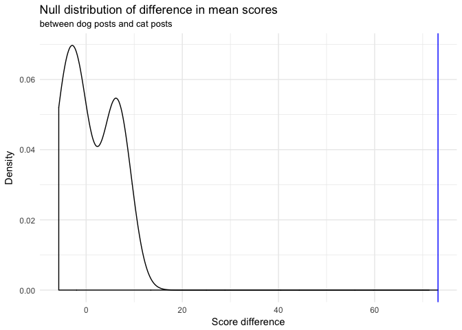

What makes a popular Reddit post?
================
InterstellR
May 2, 2018

Introduction
------------

Reddit is a social news platform owned by Conde Nast that derives its content from posts made by users from all over the world. Some like to call it "The Front Page of the Internet". Theses post can range from cute cat photos to serious news about our political system. Reddit's users truly represent individuals from different backgrounds, opinions, and places. These Reddit users upload their posts and other users vote and comment on said posts, the posts with the most likes appear more towards the top. They are divided by thematic categories called subreddits, as well as overall categories of top posts, new posts, controversial posts, among others.

TODO: Expand introduction

#### Research Question

Coincidentally, our team is made up of avid Reddit fans. All three of us are constantly checking it for interesting, insightful, and funny posts. Given that Reddit recieves thousands of posts per day and the little time in the day we have to check Reddit, we all usually only check the "popular" feed. So, it got us thinking that we should learn more about the site we use pretty frequently. Specifically, we want to analyze what makes a Reddit post popular.

#### Data Set

The data set is comprised of Reddit posts from December 2017, since it was the latest data set we could find and wanted to keep up with the most recent trends. Also, it will be interesting to explore themes related to Christmas. We retrieved it from the Google BigQuery API. The data set contains 33 variables and 1,000,000 observations.

Our dataset is made up of 33 variables but for this project, we will only be looking at these variables: `subreddit` (categorical, name of the subreddit the post belongs to), `num_comments` (numerical, the number of comments on the post),`score` (numerical, popularity score of post), `ups` (numerical, amount of up votes the post recieved), `downs` (numerical, amount of down votes the post recieved), `title` (categorical, the title of the post), `selftext` (categorical, the text body on the post), `gilded` (numerical, amount of gold reddit donations from other users), `over_18` ( categorical, true or fale if post is only appropriate for users over the age of 18), and `stickied` (categorical, whether or not post was stickied by moderators of the post's subreddit). The rest of the descriptions for the other variables can be found in our data folder.

Exploring Term Frequencies
--------------------------

As stricty popular-feed Reddit users, we do not know much about the various subreddits yet. Hence, we want to start by finding out what the most popular ones are and gain insights into what the posts in each one are about. As a measure of a subreddit's popularity, we decide to use the cumulative score of all of its posts. The plot below shows the nine subreddits with the highest resulting totals.

We find that the nine most popular subreddits in descending order are `The_Donald`, `aww`, `politics`, `pics`, `gaming`, `funny`, `gifs`, `todayilearned`, and `dankmemes`. We may be able to intuit what most of these subreddits are about from their name alone, but we wanted to know more about the content and central topics in each of them. Therefore, we decided to analyze the most frequent terms in each of these subreddits with the help of the `tidytext` package. We want to focus on the text contained in the title of the posts since it is the first thing that is visible to the users. Furthermore, we decided to filter out stop words such as "the" and "a" because they naturally appear very frequently and do not convey much about the content of any one particular subreddit.

TODO: Discuss results for this visualization

Sentiment Analysis
------------------

One of the major questions we want to explore is whether positive or negative posts are more popular. Our hypothesis is that negative posts are generally more popular, as psychologists claim that humans have an innate "negativity bias" which draws them toward bad news moreso than good ones (Ito et al. 1998). To test this belief, we need a way to determine the sentiment polarity of each post, i.e. how positive or negative it is. We will use the `afinn` sentiment lexicon, which provides a list of 2476 words, each associated with a score between -3 and +3. Negative words are given a negative score, and positive words are given a positive score. The higher in magnitude the score is, the more extreme the negativity or positivity of the word. For example, the word "death" has a score of -3 whereas the word "love" has a score of +3. In order to determine the overall sentiment of a post, we will simply add up the sentiments of the words contained in it.

We find that the average sentiment score of the posts is 0.15 with a large standard deviation of 1.94. Interestingly, the title with the most positive sentiment is "Ha ha ha ha ha ha ha ha h ha ha ha ha ha ha ha ha ha ha ha ha ha ha ha ha!," which is a result of the word "ha" having a sentiment score of 2. We will not show the most negative post here because it contains a lot of profanity. Next, let's add an indicator variable `sent_class` to the dataframe that is "pos" if the sentiment score is positive, "neg" if the sentiment score is negative, and "neutral" if it is 0.

It turns out that there are a total of 235929 positive posts, 175807 negative posts, and 588264 neutral posts in the dataset, provided that our method of determining sentiment is accurate. Let us examine a few posts from the positive and negative category to see whether the results make sense.

    ## # A tibble: 3 x 2
    ##   title                                                         sent_class
    ##   <chr>                                                         <fct>     
    ## 1 Always tempted to pull out the twins like this at the gym...… pos       
    ## 2 Unstable was one of my best drafts ever                       pos       
    ## 3 The benefits are obvious, it just takes discipline            pos

    ## # A tibble: 3 x 2
    ##   title                                                         sent_class
    ##   <chr>                                                         <fct>     
    ## 1 Finally getting started with my bass build! - but I have no … neg       
    ## 2 "Every time I try to queue up I get \"You failed to accept\"… neg       
    ## 3 This is why i fear hardcore                                   neg

It appears that the sentiment analysis results match our intuition -- the positively classified titles talk about "best drafts ever" and "obvious benefits," and the negatively classified titles talk about a technical problem with some video game and fears. We are interested in common positive and common negative words in the dataset, in order to possibly use these as features for our score prediction model. The plot below shows the ten words of each class with the most contribution to overall positivity and negativity.

Now, we can finally test our hypothesis. The null hypothesis and the alternative hypothesis are as follows.

H0: The mean post score for negative posts is equal to the mean post score of positive posts.
HA: Negative posts have a higher mean score than positive posts.

For this analysis, we will ignore posts with neutral sentiment and only focus on those with positive or negative sentiment polarity. Before we start, we need to verify whether all conditions for valid simulation based inference are met. Our "population" is the set of all Reddit posts in December 2017 and has a size of 10,567,492. Our sample is taken at random without replacement and has a size of 1,000,000. Since the sample size is less than 10% of the population size, the independence condition is therefore met. Additionally, we require more than 30 samples, which we also have.

First, we calculate the observed difference in mean score between posts with negative and positive `sent_class`.

We find that in our sample, negative posts have an average score which is 12.48 higher than positive posts. Next, let's figure out whether this difference could be due to chance using bootstrapping with permutation.

The resulting null distribution of the differences in means in shown below.

Using a one-sided hypothesis test, we find a p-value of 0. Using a significance level of 5%, we can infer that since our p-value is less than the significance level, we can reject the null hypothesis and conclude that *negative posts do indeed have a higher average mean score than positive posts*.

Cats vs. Dogs
-------------

A hotly debated question among us is whether dog or cat posts are more popular. We aim to once and for all determine which one is better using a hypothesis test. Our hypothesis is that the mean score of a post depends on whether the post mentions dogs or cats. We only look at posts which mention either of the two, but not both. First, we need to create two new variables called `dog` and `cat` in order to determine whether a title contains the word "cat" or "dog" or some variation of either term.

We observe that 0.25% of the posts mention dogs and 0.19% of the posts mention cats. Next, we are going to conduct a hypothesis test to determine whether score of a post is independent of whether its title contains "cat" or "dog". We will follow a similar procedure as for the previous test. The null hypothesis and the alternative hypothesis are as follows.

H0: A post's score is independent of whether dogs or cats are mentioned in the title.
HA: Dog posts have a higher mean score than cat posts.

For the same reasons mentioned in the previous test, we can safely conduct simlation based inference here as well. First, we calculate the observed difference in mean score between posts with negative and positive `sent_class`.

We find that, in our sample, posts that mention dogs have an average score which is 73.18 higher than those that mention cats. Next, let's figure out whether this difference could be due to chance using bootstrapping with permutation.

The resulting null distribution of the differences in means in shown below.

We can clearly see that we have a p-value of 0.2. This means that we can reject the null hypothesis and conclude that *dog posts indeed have a higher mean score than cat posts*.

Modeling Popularity
-------------------

Our main resarch goal is to find out what makes a post popular. Hence, we want to build a model that can predict the score of a given post from several of its attributes. Before doing so, we want to visualize and summarize the distribution of the posts' scores. We exclude scores higher than the 90th percentile in this visualization because these posts are scores far greater than most others, making it difficult to visualize the shape of the distribution.

It appears that the post scores follow something resembling a beta distribution. The average score is 58.66 and the standard deviation is 1027.86. The highest score by any post in December 2017 is 166121 by [this](http://www.reddit.com/r/gaming/comments/7m13gd/as_a_teen_in_the_80s_my_conservative_godfearing/) post, which is about the game Dungeons & Dragons.

#### Feature Engineering

We would like to build a model that predicts a post's score from various features, so we need to decide which features we want to look at. We start by creating a variable that denotes the total uptime of the post, i.e. the difference between the time it was retrieved and the time it was created. Both of these quantitites are given as the number of seconds from a time origin, so we can simply compute the difference between the two and convert the result into hours, as that will be a more interpretable quantity.

Next, we want to have a variable that denotes the length of the title as well as the body text of each post. Hence, we compute the number of characters in `title` and store it in a new variable `title_length`.

We would like to include the `subreddit` variable, but there are 64531 levels which will increase the model complexity too much. Hence, we only include indicator variables for the nine most popular subreddits we explored earlier as well as one additional level called "other".

We will also include the two variables we created earlier -- `sent_class` and `animal` -- as well as `gilded`, `stickied`, and `num_comments`. Next, we remove posts where the score is hidden or any of the predictor variables are missing.

This leaves us with 995003 posts out of the original 1,000,000.

#### Modeling

Our first approach will be a linear model, optimized using backward selection by AIC.

    ## Start:  AIC=1.4e+07
    ## score ~ uptime + title_length + gilded + stickied + num_comments + 
    ##     sent_class + animal + subreddit_
    ## 
    ##                Df Sum of Sq      RSS      AIC
    ## - uptime        1  6.57e+05 8.71e+11 13614367
    ## <none>                      8.71e+11 13614368
    ## - title_length  1  2.14e+06 8.71e+11 13614368
    ## - sent_class    2  4.71e+06 8.71e+11 13614369
    ## - animal        2  1.95e+07 8.71e+11 13614386
    ## - stickied      1  2.08e+07 8.71e+11 13614390
    ## - subreddit_    9  4.45e+09 8.76e+11 13619422
    ## - gilded        1  2.03e+10 8.92e+11 13637322
    ## - num_comments  1  1.43e+11 1.01e+12 13765773
    ## 
    ## Step:  AIC=1.4e+07
    ## score ~ title_length + gilded + stickied + num_comments + sent_class + 
    ##     animal + subreddit_
    ## 
    ##                Df Sum of Sq      RSS      AIC
    ## <none>                      8.71e+11 13614367
    ## - title_length  1  2.11e+06 8.71e+11 13614367
    ## - sent_class    2  4.73e+06 8.71e+11 13614368
    ## - animal        2  1.95e+07 8.71e+11 13614385
    ## - stickied      1  2.09e+07 8.71e+11 13614388
    ## - subreddit_    9  4.45e+09 8.76e+11 13619421
    ## - gilded        1  2.03e+10 8.92e+11 13637320
    ## - num_comments  1  1.43e+11 1.01e+12 13765773

    ##                       term estimate
    ## 1              (Intercept)  421.949
    ## 2             title_length   -0.036
    ## 3                   gilded 4621.642
    ## 4             stickiedtrue -133.418
    ## 5             num_comments    3.926
    ## 6            sent_classpos   -2.981
    ## 7            sent_classneg    3.899
    ## 8                animaldog   86.902
    ## 9                animalcat   27.182
    ## 10     subreddit_dankmemes    1.897
    ## 11         subreddit_funny -165.243
    ## 12        subreddit_gaming -135.634
    ## 13          subreddit_gifs  691.890
    ## 14         subreddit_other -405.045
    ## 15          subreddit_pics   -3.026
    ## 16      subreddit_politics -113.407
    ## 17    subreddit_The_Donald -141.081
    ## 18 subreddit_todayilearned  243.961

Looking at the slope coefficients for our selected model's variables of `gilded`, `num_comments`, `stickied`, and `sent_class`, we can analyze the following. For every one gilded point a Reddit post receives, the score goes up by 4,622, given that all other variables remain constant. This makes sense since user really must like a post if they're willing to pay a gold donation to the creator. For every one comment the Reddit post recieves, the score goes by 3.9, given that all other variables remain constant. For when a post gets stickied by the moderators of the subreddits, the score goes down by 144.3, given that all other variables remain constant. This is an interesting analysis because we would expect a post that gets attention from the moderators and gets placed at the top of the feed would recieve a higher score but apparently that is not the case. Lastly, when a post's title is of neutral sentiment, the post's score goes down by 6.7 and if the post's title is of positive sentiment, the post's score goes down by 8.

We find an R2 value of 0.18, which means that the model can only explain 17.53% of the variance of the post scores. However, this may not be too surprising, since the scores definitely do not follow a multivariate linear model. Nor do any of the predictor variables include much information about the content of the post itself, since the text is not included in the model at all. We think that including the actual text information may help us improve our model. To do this, we need to encode the title's text into numeric variables, where each unique word has its own column. The package `tm` lets us convert our tidy create such a representation, also called document-term matrix. Note that the string in each row represents the unique ID of each post.

Now, we have a total of 95 variables in the dataframe, where the new ones represents the tf-idf weight of a unique word in the title of the post. Note that we had to eliminate many of the terms in order for it to fit into memory. We did this using the `removeSparseTerms` function from `tm`, which removes terms from the matrix until it has a percentage of elements which are zero that is at least 99.5%. Let's again build a linear model using backwords selection and see whether the new variables improve the results.

    ## Start:  AIC=1.3e+07
    ## score ~ num_comments + gilded + stickied + sentiment + sent_class + 
    ##     dog + cat + uptime + title_length + subreddit_ + video + 
    ##     christmas + time + love + home + day + `7` + people + amp + 
    ##     `2017` + `20` + guys + `12` + world + ps4 + bitcoin + reddit + 
    ##     xbox + `3` + `5` + trump + `1` + `2018` + girl + december + 
    ##     level + news + free + game + question + m4f + `18` + `17` + 
    ##     white + https + t.co + `10` + keys + black + `2` + `4` + 
    ##     games + business + online + pc + national + live + post + 
    ##     play + found + top + buy + life + watch

We find that the resulting R2 is 0.18, which is not much better than the previous model. It appears that adding the new variables has not helped much. However, maybe a linear model is simply not the right choice.

Discussion
----------

Conclusion
----------

References
----------

Ito, Tiffany A., Jeff T. Larsen, N. Kyle Smith, and John T. Cacioppo. 1998. “Negative Information Weighs More Heavily on the Brain: The Negativity Bias in Evaluative Categorizations.” *Journal of Personality and Social Psychology* 75 (4): 887–900. <https://search.ebscohost.com/login.aspx?direct=true&db=pdh&AN=1998-12834-004&site=ehost-live&scope=site>.
