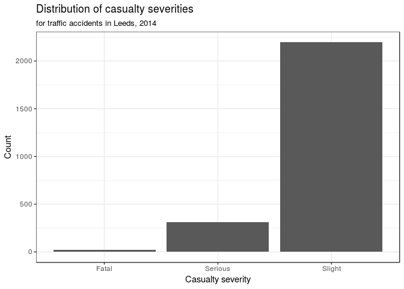
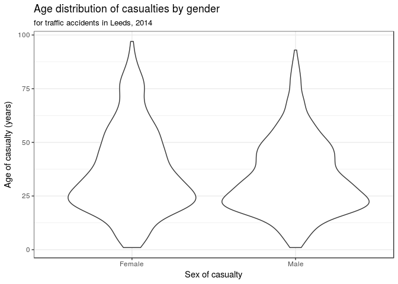

Road Traffic Accidents in the UK
================
InterstellR
March 27, 2018

Section 1. Introduction
-----------------------

Due to the increasing amounts of traffic accidents in recent years, which were cause to an estimated 40,000 deaths in 2016 in the United States alone ([source](http://fortune.com/2017/02/15/traffic-deadliest-year/)), for our research project, we want improve our understanding of the causes of such accidents. Specifically, we will try to answer the question: *What factors impact the likelihood and severity of road accidents?* We will do so by looking at car accident data for the city of Leeds in West Yorkshire, England, from the year 2014. The dataset was published by the Leeds City Council and can be found [here](https://data.gov.uk/dataset/road-traffic-accidents/resource/fa7bb4b9-e4e5-41fd-a1c8-49103b35a60f). Unfortunately, the publisher does not provide the methodology by which the data was collected. The dataset contains 2533 rows, each of which represents a single accident for a single person. If multiple people were involved in an accident, they appear as separate entries. In total, there are 16 variables, which are described in detail in the accompanying codebook. These reveal information such as the time, place, severity, and weather conditions of the accident as well as the gender and age of the person involved. We hope that a this analysis will allow us to uncover the major causes of accidents and aid as a source for improvements to traffic safety and accident prevention.

Section 2. Data analysis plan
-----------------------------

We plan to focus our data analysis on two main components. First, we will build an ordinal logistic regression model that can predict the `Casualty Severity` of an accident as either "Slight", "Serious", or "Fatal" from a set of features. Lastly, we want to test whether the weather conditions impact the severity of an incident.

As mentioned, we want to build an ordinal logistic regression model to predict the dependent variable `Casualty Severity`. Initially, our predictor variables will be `Time (24h)`, `1st Road Class`, `Road Surface`, `Lighting Conditions`, `Sex of Casualty`, `Age of Casualty`, and `Type of Vehicle`, but we may end up discarding some if they do not prove useful. We are not intending to include the location of the accident because we believe that that would require a more complex model. Furthermore, we plan to include an additional precitor, `Season`, which was not part of the original dataset, but can be synthesized from the `Accident Date` variable.

Let's take a quick look at the distribution of the casualty severities.

``` r
ggplot(accidents, aes(x = `Casualty Severity`)) +
  geom_histogram(stat = "count") +
  labs(
    title = "Distribution of casualty severities",
    subtitle = "for traffic accidents in Leeds, 2014",
    x = "Casualty severity",
    y = "Count"
  ) +
  theme_bw()
```

    ## Warning: Ignoring unknown parameters: binwidth, bins, pad



``` r
num_fatal <- filter(accidents, `Casualty Severity` == "Fatal") %>% nrow()
num_serious <- filter(accidents, `Casualty Severity` == "Serious") %>% nrow()
num_slight <- filter(accidents, `Casualty Severity` == "Slight") %>% nrow()
```

We can see that only 23 accidents turned out fatal, whereas 313 were serious and 2197 were only slight. Since `Age of Casualty` is one of our predictor variables, let's visualize how this variable is distributed using a violin plot.

``` r
ggplot(accidents, aes(y = `Age of Casualty`, x = `Sex of Casualty`)) +
  geom_violin() +
  labs(
    title = "Age distribution of casualties by gender",
    subtitle = "for traffic accidents in Leeds, 2014",
    x = "Sex of casualty",
    y = "Age of casualty (years)"
  ) +
  theme_bw()
```



``` r
median_age_m <- accidents %>%
  filter(`Sex of Casualty` == "Male") %>%
  summarize(median_age = median(`Age of Casualty`)) %>%
  pull(median_age)
median_age_f <- accidents %>%
  filter(`Sex of Casualty` == "Female") %>%
  summarize(median_age = median(`Age of Casualty`)) %>%
  pull(median_age)
```

We can see that a large proportion of people were around 25 years old. Furthermore, we can see that there does not appear to be a significant difference in the distribution of male and female casualty ages. The median age for male casualties was 30, similar to the median age for female casualties, which was 32.

Additional research is necessary, but we think that we can use the `polr` function from the MASS package to build the ordinal logistic regression model.

Section 3. Data
---------------

The dataset can be found in the /data folder of this project and is almost identical to the one we downloaded from the source. However, one column did not have a header, so we manually named it "Casual Class Desc". The output of the `glimpse` function for our dataset is shown below.

``` r
glimpse(accidents)
```

    ## Observations: 2,533
    ## Variables: 16
    ## $ `Reference Number`    <chr> "1112091", "1180869", "1180869", "11A023...
    ## $ `Grid Ref: Easting`   <int> 429175, 430429, 430429, 424660, 424660, ...
    ## $ `Grid Ref: Northing`  <int> 431904, 431025, 431025, 427582, 427582, ...
    ## $ `Number of Vehicles`  <int> 2, 3, 3, 3, 3, 2, 3, 1, 1, 4, 4, 2, 1, 2...
    ## $ `Accident Date`       <chr> "01-Jan-14", "08-Jan-14", "08-Jan-14", "...
    ## $ `Time (24hr)`         <int> 1840, 1430, 1430, 817, 817, 1220, 1828, ...
    ## $ `1st Road Class`      <chr> "Unclassified", "Motorway", "Motorway", ...
    ## $ `Road Surface`        <chr> "Wet / Damp", "Wet / Damp", "Wet / Damp"...
    ## $ `Lighting Conditions` <chr> "Darkness: street lights present and lit...
    ## $ `Weather Conditions`  <chr> "Raining without high winds", "Fine with...
    ## $ `Casualty Class`      <int> 1, 1, 1, 1, 1, 1, 1, 3, 1, 1, 1, 1, 3, 2...
    ## $ `Casualty Class Desc` <chr> "Driver", "Driver", "Driver", "Driver", ...
    ## $ `Casualty Severity`   <chr> "Slight", "Slight", "Slight", "Slight", ...
    ## $ `Sex of Casualty`     <chr> "Male", "Male", "Female", "Male", "Male"...
    ## $ `Age of Casualty`     <int> 58, 69, 41, 35, 25, 20, 38, 23, 28, 23, ...
    ## $ `Type of Vehicle`     <chr> "Car", "Car", "Car", "Car", "Car", "Car"...
